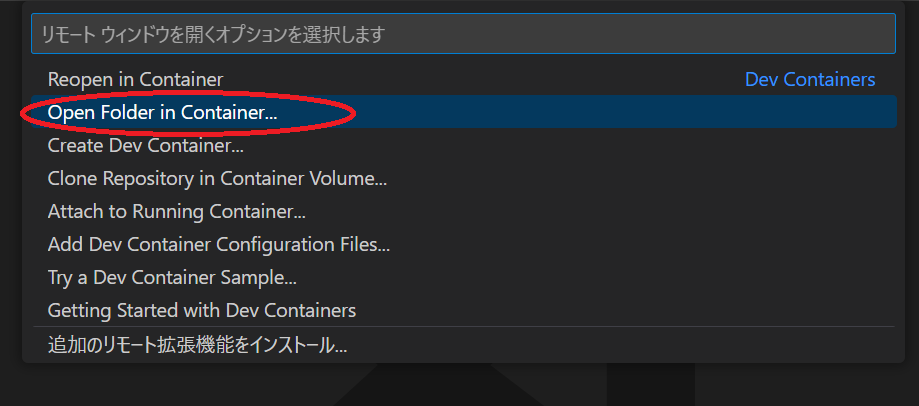

# Docker + beego + mysqlでToDoアプリを作る

こんにちは、hashiです。
直近の業務で触れたGo言語のスキルアップのため、  
1からGoの環境構築、ToDoアプリの作成をしてみました。
その過程や完成したアプリについて備忘録としてここに残そうと思います。

## 動作環境

- Windows 10 または macOS Ventura バージョン13.0.1
- docker-compose
- VSCode

## 環境構築

ここではコンテナ内にgoの開発環境を構築し、VSCodeを通してリモート接続することで、  
PCの環境を汚すことなく環境構築を行いました。

### beego,mysqlのコンテナ作成

まずディレクトリを作成します。名前は`docker-golang-study`としました。
その中に以下のディレクトリ構成でファイルを配置します。

```sh
├── beego
│   ├── .go_env
│   └── Dockerfile
├── mysql
│   ├── initdb.d
│   │   └── beego_local.sql
│   ├── Dockerfile
│   ├── my.cnf
├── .env
├── docker-compose.yml
```

(各ファイルの中身を解説)

### イメージ作成

以下のコマンドを実行してイメージを作成し、beegoのプロジェクトを作成します。

```sh
# imageの作成
docker-compose build

# `bee new (プロジェクト名)`をコンテナ内で実行して新しいプロジェクトを作成
docker-compose run app bee new app
docker-compose run app sh -c "cd app && go get app"
```

### コンテナの起動と動作確認

以下のコマンドを実行してコンテナを起動します。

```sh
docker-compose up
```

(ログの一部を貼る)

(8080をブラウザから見た画像を貼る)

### beegoのコンテナへリモート接続

beegoのコンテナにリモート接続するために必要なのが以下の拡張機能(Dev Containers)です。  
まずこれをインストール。

拡張機能をインストール後、ウインドウ左下の緑色のマークをクリック。

`Open Folder in Container...`を選択して……

`beego`のプロジェクトがあるディレクトリを選択します。

すると、コンテナ内のファイルを直接編集することができるようになります。
この中で拡張機能をインストールしてもローカルには影響がないため、安心して開発できます。

自分は以下の拡張機能をインストールしました。  
自動フォーマットなど便利機能が搭載されていて便利です。

