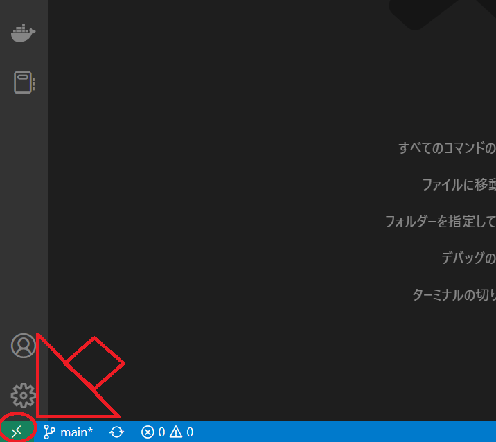

# Docker + beego + mysqlでToDoアプリを作る (環境構築編)

こんにちは、hashiです。  
直近の業務で触れたGo言語のスキルアップのため、1からGoの環境構築、ToDoアプリの作成をしました。  
その過程や完成したアプリについて備忘録としてここに残そうと思います。

## 動作環境

- Windows 10 または macOS Ventura バージョン13.0.1
- docker-compose
- VSCode

## 環境構築

コンテナ内にgoの開発環境を構築し、VSCodeを通してリモート接続することで、  
PCの環境を汚すことなく環境構築を行いました。

### beego,mysqlのコンテナ作成

まずディレクトリを作成します。名前は`docker-golang-study`としました。
その中に以下のディレクトリ構成でファイルを配置します。

```sh
├── beego
│   └── Dockerfile
├── mysql
│   ├── initdb.d
│   │   └── beego_local.sql
│   ├── Dockerfile
│   ├── my.cnf
├── .env
├── docker-compose.yml
```

### 各ファイルの解説

以下に各ファイルの内容と、その解説を記載します。

#### docker-compose.yml

DBとアプリ本体の2つのコンテナを立てるため、以下の設定を記載します。  

- DBの永続化のため`volumes`で`/var/lib/mysql`を保持する
- DBのコンテナ起動時に実行するSQLの指定
- アプリより先にDBを起動させるため、`app`の`depends_on`に`db`を指定
- ポートの開放

```yaml
version: "3.8"

services:
  db:
    build: ./mysql
    volumes:
      - ./mysql/initdb.d/:/docker-entrypoint-initdb.d
      - db-store:/var/lib/mysql
    env_file:
      - ./.env
    ports:
      - 3306:3306
    container_name: mysql-container
  app:
    build: ./beego
    command: >
      sh -c "cd app &&
              bee run"
    working_dir: /go/src/github.com/app
    volumes:
      - ./beego:/go/src/github.com/app
    env_file:
      - ./.env
    ports:
      - 8080:8080
    depends_on:
      - db
    container_name: beego-container
volumes:
  db-store:
```

#### .env

主にmysqlの設定値を記載しています。

```text
MYSQL_DATABASE=beego_local
MYSQL_USER=study_user
MYSQL_PASSWORD=study_pass
MYSQL_ROOT_PASSWORD=qwerty
MYSQL_HOST=db
MYSQL_PORT=3306
TZ=Asia/Tokyo
```

#### beego/Dockerfile

goのDockerイメージを元に、必要に応じてアップデート、インストールしています。

```Dockerfile
# goバージョン
FROM golang:1.19-alpine as go-base
# 環境変数を設定
ENV SRC_DIR="/go/src/github.com/"\
    GOPATH="/go"\
    PATH="$GOPATH:$SRC_DIR:$PATH"

FROM go-base as initial
# アップデートとgitのインストール
RUN apk update && apk add git

FROM initial as development-base
# ディレクトリの作成
RUN mkdir -p /go/src/github.com/
# ワーキングディレクトリの設定
WORKDIR /go/src/github.com/

FROM development-base as development
# ホストのファイルをコンテナの作業ディレクトリに移行
ADD . /go/src/github.com/
# パッケージのインポート
RUN go install github.com/beego/bee/v2@v2.0.4
```

#### mysql/Dockerfile

後述する設定ファイルをコピーしています。

```Dockerfile
FROM mysql:8.0

# 設定ファイルのコピー
COPY ./my.cnf /etc/mysql/conf.d/my.cnf
# 権限設定
RUN chmod 644 /etc/mysql/conf.d/my.cnf
```

#### mysql/my.cnf

DBの文字コードをUTF-8に設定しています。

```text
[mysqld]
character_set_server = utf8mb4
collation_server = utf8mb4_0900_ai_ci

# timezone
default-time-zone = SYSTEM
log_timestamps = SYSTEM

[mysql]
default-character-set = utf8mb4

[client]
default-character-set = utf8mb4
```

#### mysql/initdb.d/beego_local.sql

コンテナ起動時に実行されるSQLです。  
アプリで使用するデータベースの`beego_local`を作成します。

```sql
CREATE DATABASE IF NOT EXISTS beego_local;
```

### イメージ作成

以下のコマンドを実行してイメージを作成し、beegoのプロジェクトを作成します。

```sh
# imageの作成
docker-compose build

# `bee new (プロジェクト名)`をコンテナ内で実行して新しいプロジェクトを作成
docker-compose run app bee new app
docker-compose run app sh -c "cd app && go get app"
```

### コンテナの起動と動作確認

以下のコマンドを実行してコンテナを起動します。

```sh
docker-compose up
```

以下のようなログが出るはずです。

```sh
docker-golang-study-app-1  | 2022/12/13 13:58:19 INFO     ▶ 0001 Getting bee latest version...
docker-golang-study-app-1  | 2022/12/13 13:58:19 INFO     ▶ 0002 Your bee are up to date
docker-golang-study-app-1  | ______
docker-golang-study-app-1  | | ___ \
docker-golang-study-app-1  | | |_/ /  ___   ___
docker-golang-study-app-1  | | ___ \ / _ \ / _ \
docker-golang-study-app-1  | | |_/ /|  __/|  __/
docker-golang-study-app-1  | \____/  \___| \___| v2.0.4
docker-golang-study-app-1  | 2022/12/13 13:58:19 INFO     ▶ 0003 Using 'app' as 'appname'
docker-golang-study-app-1  | 2022/12/13 13:58:19 INFO     ▶ 0004 Initializing watcher...
docker-golang-study-app-1  | go: downloading github.com/beego/beego/v2 v2.0.1
docker-golang-study-app-1  | 2022/12/13 13:59:34 SUCCESS  ▶ 0005 Built Successfully!
docker-golang-study-app-1  | 2022/12/13 13:59:34 INFO     ▶ 0006 Restarting 'app'...
docker-golang-study-app-1  | 2022/12/13 13:59:34 SUCCESS  ▶ 0007 './app' is running...
docker-golang-study-app-1  | 2022/12/13 13:59:35.613 [I] [parser.go:413]  generate router from comments
docker-golang-study-app-1  | 
docker-golang-study-app-1  | 2022/12/13 13:59:35.621 [I] [server.go:241]  http server Running on http://:8080
```

<http://localhost:8080/>にアクセスすると……

きちんとbeegoが起動していますね。

### beegoのコンテナへリモート接続

beegoのコンテナにリモート接続するために必要なのが以下の拡張機能(Dev Containers)です。  
まずこれをインストール。  
  
拡張機能をインストール後、ウインドウ左下の緑色のマークをクリック。  
  
`Open Folder in Container...`を選択して……  
  
`beego`のプロジェクトがあるディレクトリを選択します。  
  
すると、コンテナ内のファイルを直接編集することができるようになります。  
この中で拡張機能をインストールしてもローカルには影響がないため、安心して開発できます。  
  
自分は以下の拡張機能をインストールしました。  
自動フォーマットなど便利機能が搭載されていて便利です。  
  

## いったんまとめ

これで開発環境が整いました。`Dev_Containers`の拡張機能の恩恵は大きいですね。  
beegoで本格的にToDoアプリを作成するのは次回の記事で書くことにします。
