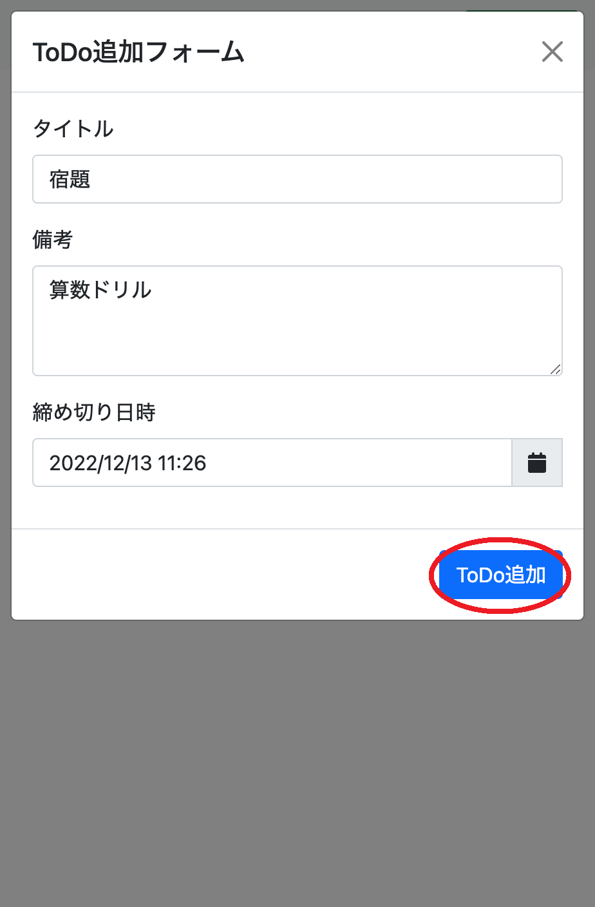
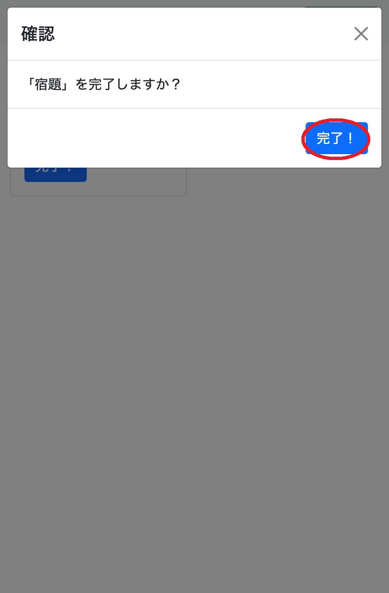

# Docker + beego + mysqlでToDoアプリを作る (アプリ作成編)

こんにちは、hashiです。  
「Docker + beego + mysqlでToDoアプリを作る」の後半として、  
この記事では環境構築以降のアプリ作成についてまとめようと思います。

## 動作環境

- Windows 10 または macOS Ventura バージョン13.0.1
- docker-compose
- VSCode

## アプリ概要

ToDoの新規作成をすると画面上に並びます。  
ToDoはDBに保存されるためリロード、キャッシュ削除などをしても消えず、  
完了ボタンを押すことで削除されます。

### ToDo追加の流れ

|ToDo一覧画面(0件)|ToDo追加フォーム|ToDo追加モーダル|ToDo一覧画面(1件)|
|-|-|-|-|
|「新規作成」ボタンを押下する|内容を入力する|「ToDo追加」ボタンを押下する|ToDoが追加された!|
|||||

### ToDo完了の流れ

|ToDo一覧画面(1件)|完了確認モーダル|ToDo一覧画面(0件)|
|-|-|-|
|完了したいToDoの「完了」ボタンを押下する|完了確認モーダルの「完了」ボタンを押下する|ToDoが削除された!|
||||

## アプリ作成

前の記事で作成したbeegoのプロジェクトを編集する形でアプリ作成を行います。
ソースは[こちら](https://github.com/maruuuui/docker-golang-study)で公開しています。

### ディレクトリ構成

以下のディレクトリ構成でファイルを配置します。

```text
beego
├── app
│   ├── conf
│   │   └── app.conf
│   ├── controllers
│   │   ├── default.go
│   │   └── toDo.go
│   ├── models
│   │   └── toDo.go
│   ├── routers
│   │   ├── commentsRouter_controllers.go
│   │   └── router.go
│   ├── static
│   │   └── (省略)
│   ├── views
│   │   └── index.tpl
│   ├── go.mod
│   ├── go.sum
│   └── main.go
└── Dockerfile
```

### 各ファイルの解説

以下に各ファイルの内容と、その解説を記載します。

#### app/conf/app.conf

主にDBへの接続情報を記載します。
`db_host`のホスト名は`localhost`や`0.0.0.0`ではなくDBのコンテナ名にする必要があることに注意。

```sh
appname = app
httpport = 8080
runmode = dev

db_driver_name = mysql
db_name = beego_local
db_user_name = study_user
db_user_password = study_pass
db_host = tcp(mysql-container:3306)

# これがないとコントローラでリクエストを解析できないので注意
copyrequestbody = true
```

#### app/controllers/default.go

アプリのHTMLを扱うコントローラです。

```go
package controllers

// 画面を扱うコントローラ

import (
 "app/models"
 "sort"

 beego "github.com/beego/beego/v2/server/web"
)

type MainController struct {
 beego.Controller
}

// フロントで使用する形式に変換したコンテンツ
type ToDoResponse struct {
 ID       string `json:"id"`
 Title    string `json:"title"`
 Memo     string `json:"memo"`
 Deadline string `json:"deadline"`
}

type ToDoListResponse = []ToDoResponse

func (c *MainController) Get() {

 // 全件取得
 toDoList := models.GetAllToDo()

 // 締め切り日時でソート
 sort.Slice(toDoList, func(i, j int) bool { return toDoList[i].Deadline.Before(toDoList[j].Deadline) })

 toDoListResponse := ToDoListResponse{}
 for _, toDo := range toDoList {
  // time.Time型のdeadlineをYYYY/MM/DD HH:MM形式の文字列にパースする
  toDoResponse := ToDoResponse{
   toDo.ID,
   toDo.Title,
   toDo.Memo,
   toDo.Deadline.Format("2006/01/02 15:04"),
  }
  toDoListResponse = append(toDoListResponse, toDoResponse)
 }

 c.Data["toDoList"] = toDoListResponse
 c.TplName = "index.tpl"
}
```

#### app/controllers/toDo.go

アプリのフロントエンドからのリクエストに対応するコントローラです。
(例)ToDoの新規作成、ToDoの完了(削除)

```go
package controllers

// 画像ファイルを配信するコントローラ

import (
 "app/models"
 "encoding/json"
 "fmt"
 "time"

 beego "github.com/beego/beego/v2/server/web"
)

type ToDoController struct {
 beego.Controller
}

// Createのリクエストボディ
type CreateRequestBody struct {
 Title    string `json:"title"`
 Memo     string `json:"memo"`
 Deadline string `json:"deadline"`
}

// Deleteのリクエストボディ
type DeleteRequestBody struct {
 ID string `json:"id"`
}

// @router / [get]
func (c *ToDoController) Get() {
 var toDoList = models.GetAllToDo()

 c.Data["json"] = toDoList
 c.ServeJSON()
}

// @router / [post]
func (c *ToDoController) Post() {
 fmt.Println("Post")
 // CreateRequestBodyにパースする
 var createRequestBody CreateRequestBody
 if err := json.Unmarshal(c.Ctx.Input.RequestBody, &createRequestBody); err != nil {
  c.Ctx.Output.SetStatus(500)
  c.Data["json"] = "json parse error"
  c.ServeJSON()
  return
 }
 fmt.Println("createRequestBody", createRequestBody)

 // YYYY/MM/DD HH:MM形式の文字列をタイムゾーンを指定してtime.Timeにパース
 jst, _ := time.LoadLocation("Asia/Tokyo")
 deadline, err := time.ParseInLocation(
  "2006/01/02 15:04",
  createRequestBody.Deadline,
  jst,
 )

 if err != nil {
  c.Ctx.Output.SetStatus(400)
  c.Data["json"] = "datetime parse error"
  c.ServeJSON()
  return
 }

 toDo := models.CreateToDo(
  createRequestBody.Title,
  createRequestBody.Memo,
  deadline,
 )

 c.Data["json"] = toDo
 c.ServeJSON()
}

// @router /:id [delete]
func (c *ToDoController) Delete() {
 fmt.Println("Delete")
 id := c.Ctx.Input.Param(":id")
 fmt.Println("deleteRequest", id)

 models.DeleteToDo(id)

 c.ServeJSON()
}
```

#### app/models/toDo.go

ToDoの構造体を定義しています。
DB操作もここで行っています。

```go
package models

import (
 "time"

 beego "github.com/beego/beego/v2/server/web"
 "github.com/google/uuid"
 "gorm.io/driver/mysql"
 "gorm.io/gorm"
)

// ToDoの構造体を作成する
type ToDo struct {
 // ToDoのID
 ID string `gorm:"primaryKey" json:"id"`
 // ToDoのタイトル
 Title string `json:"title"`
 // メモ
 Memo string `json:"memo"`
 // 締め切り日時
 Deadline time.Time `json:"deadline"`
 // 作成日時 DB保存時に自動的に入る値
 CreatedAt time.Time `json:"createdAt"`
}

// ToDoListタイプを作成
type ToDoList []ToDo

// DB接続用
var db = setupDB()

// 1件作成
func CreateToDo(title string, memo string, deadline time.Time) (toDO ToDo) {
 toDO = ToDo{
  ID:       uuid.New().String(),
  Title:    title,
  Memo:     memo,
  Deadline: deadline,
 }
 result := db.Create(&toDO)
 if result.Error != nil {
  panic("failed to create todo")
 }
 return toDO
}

// 全件取得
func GetAllToDo() (toDoList ToDoList) {
 result := db.Find(&toDoList)
 if result.Error != nil {
  panic("failed to get todo")
 }
 return
}

// 1件取得
func GetToDo(id string) (toDo ToDo) {
 toDo = ToDo{
  ID:    "hogehoge",
  Title: "ToDoのタイトルが入ります",
  Memo:  "メモです",
 }
 return
}

// Delete
func DeleteToDo(id string) {
 toDo := ToDo{
  ID: id,
 }
 db.Delete(&toDo)
}

func setupDB() (db *gorm.DB) {

 mysqlUser, err := beego.AppConfig.String("db_user_name")
 if err != nil {
  panic("failed to get db_user_name")
 }
 mysqlPass, err := beego.AppConfig.String("db_user_password")
 if err != nil {
  panic("failed to get db_user_password")
 }
 mysqlHost, err := beego.AppConfig.String("db_host")
 if err != nil {
  panic("failed to get db_host")
 }
 mysqldb, err := beego.AppConfig.String("db_name")
 if err != nil {
  panic("failed to get db_name")
 }

 dsn := mysqlUser + ":" + mysqlPass + "@" + mysqlHost + "/" + mysqldb + "?charset=utf8mb4&parseTime=True&loc=Local"
 db, err = gorm.Open(mysql.Open(dsn), &gorm.Config{})
 if err != nil {
  panic("failed to connect database")
 }
 return db
}
```

#### app/routers/router.go

プロジェクト作成時に自動生成されたファイルに、新規に作成したAPIのパスを追加しています。

```go
package routers

import (
 "app/controllers"

 beego "github.com/beego/beego/v2/server/web"
)

func init() {
 beego.Router("/", &controllers.MainController{})
 ns := beego.NewNamespace("/todo",
  beego.NSInclude(&controllers.ToDoController{}),
 )
 beego.AddNamespace(ns)
}
```

#### app/main.go

プロジェクト作成時に自動生成されたファイルに、DBとの接続処理を追記しています。

```go
package main

import (
 "app/models"
 _ "app/routers"

 beego "github.com/beego/beego/v2/server/web"
 "gorm.io/driver/mysql"
 "gorm.io/gorm"
)

func main() {
 setupDB()
 beego.Run()
}

func setupDB() {

 mysqlUser, err := beego.AppConfig.String("db_user_name")
 if err != nil {
  panic("failed to get db_user_name")
 }
 mysqlPass, err := beego.AppConfig.String("db_user_password")
 if err != nil {
  panic("failed to get db_user_password")
 }
 mysqlHost, err := beego.AppConfig.String("db_host")
 if err != nil {
  panic("failed to get db_host")
 }
 mysqldb, err := beego.AppConfig.String("db_name")
 if err != nil {
  panic("failed to get db_name")
 }
 dsn := mysqlUser + ":" + mysqlPass + "@" + mysqlHost + "/" + mysqldb + "?charset=utf8mb4&parseTime=True&loc=Local"
 db, err := gorm.Open(mysql.Open(dsn), &gorm.Config{})
 if err != nil {
  panic("failed to connect database")
 }

 // Migrate the schema
 db.AutoMigrate(&models.ToDo{})

}
```

#### その他のファイル

ここで紹介しなかったファイルは、自動生成されたファイルであることや長すぎることが理由で省略しています。  
参照する必要がある場合は[こちら](https://github.com/maruuuui/docker-golang-study)から元ファイルを参照してください。
