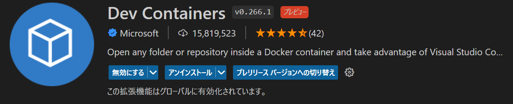
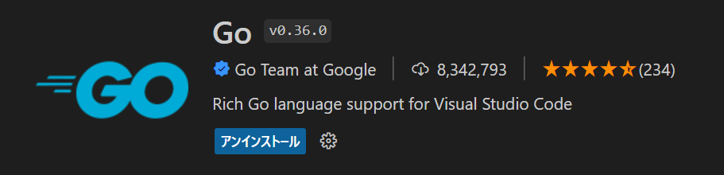

# 手順メモ

- beego/Dockerfile
- mysql/initdb.d/beego_local.sql
- mysql/Dockerfile
- mysql/my.cnf
- .env
- docker-compose.yaml
以上のファイルを配置してから以下のコマンドを実行

```sh
# imageの作成
docker-compose build

# `bee new (プロジェクト名)`をコンテナ内で実行して新しいプロジェクトを作成
docker-compose run app bee new app
docker-compose run app sh -c "cd app && go get app"
```

vscodeの拡張機能(Dev Containers)でbeegoのコンテナにリモート接続


コンテナ内で拡張機能(Go)をインストール。自動フォーマットなど便利機能が搭載されてる


DB操作のため、ORM本体とmysqlのドライバをインストール

go get -u gorm.io/gorm
go get -u gorm.io/driver/mysql


参考サイトメモ

DB操作
https://www.wakuwakubank.com/posts/869-go-database-sql/
テンプレート
https://selfnote.work/20191003/programming/golang-beego-basic1/
bootstrap
https://getbootstrap.com/docs/5.2/getting-started/introduction/
minigrid
https://github.com/hnqlv/minigrid